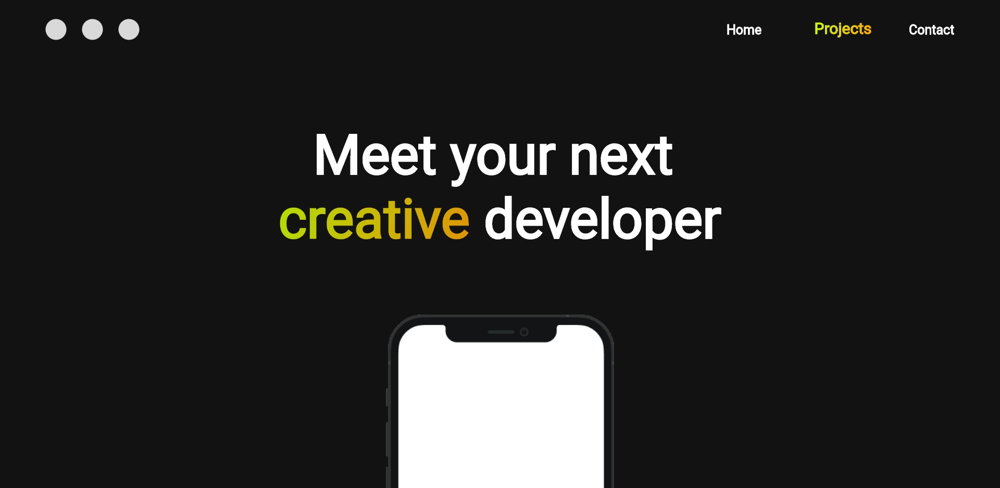

# Portfolio With Flutter

Making a portfolio website using Flutter.

## Contributors

- Designed by  <a href = "https://github.com/muhammadmunaf" alt = "munafs github id" >Muhammad Munaf <a>

## Screenshots

Mobile version cmoing..
